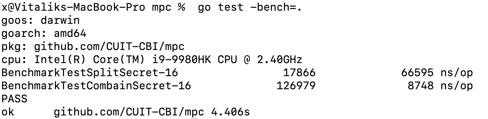

# Secret Share

## Usage

Run ```go get github.com/CUIT-CBI/mpc``` on your cmd line

Example:
```
    package main

    import (
        github.com/CUIT-CBI/mpc
    )

    func main() {
        secrets := []byte("Hello world!")
        parts := mpc.SplitSecret(secret, 5, 3)
        recovered := mpc.CombainSecret(parts[1:4])
        fmt.Println(string(recovered))
    }
```


## Test
```
    go test
```

### Benchmark Test
```
    go test -bench=.
```

### Benchmark Test Result

